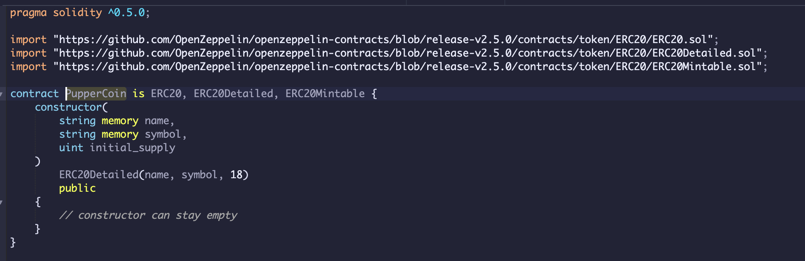
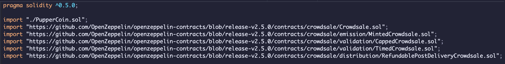
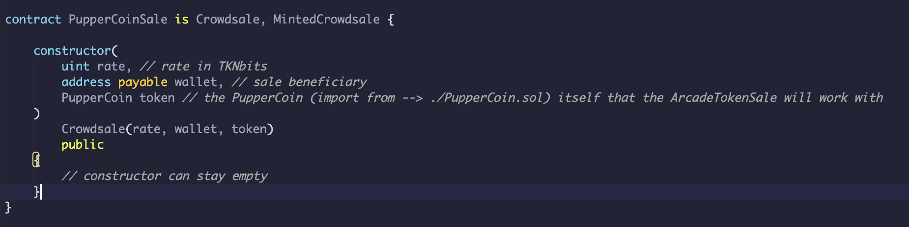
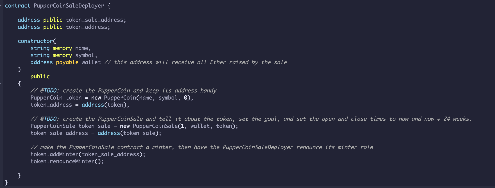
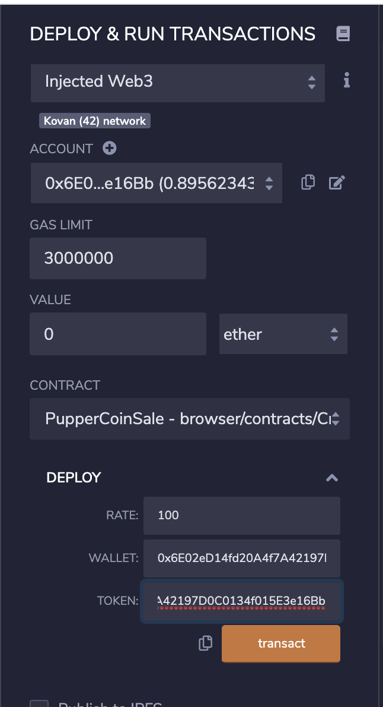
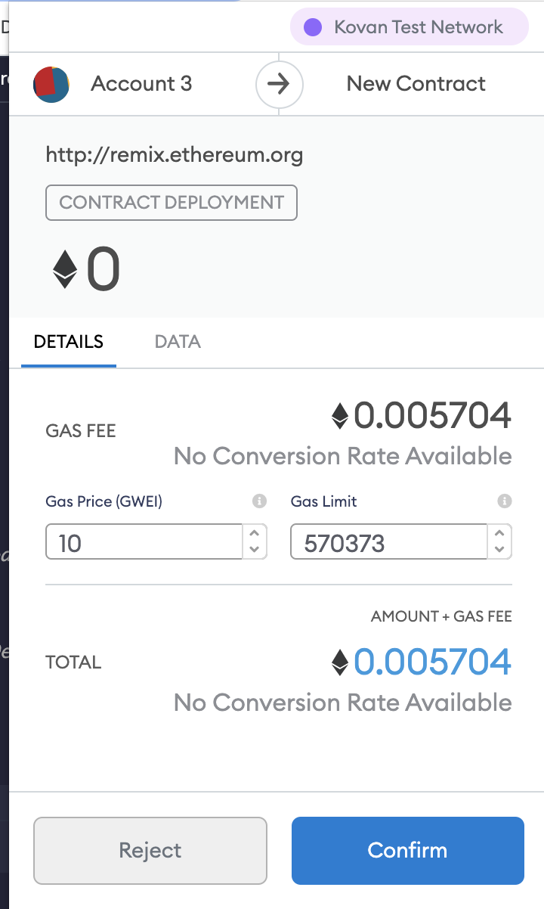
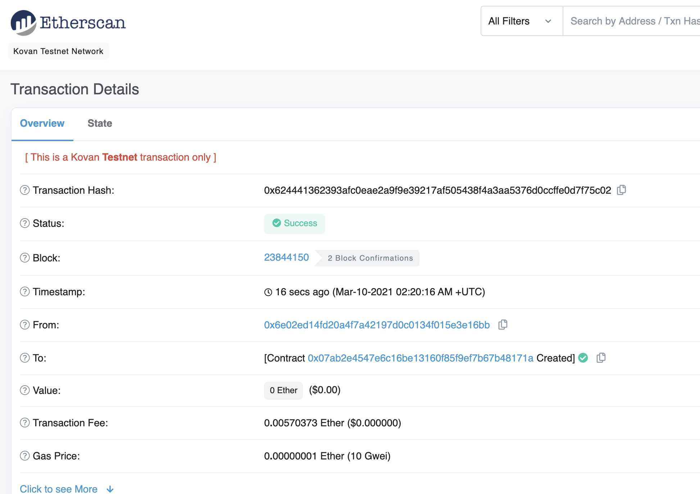
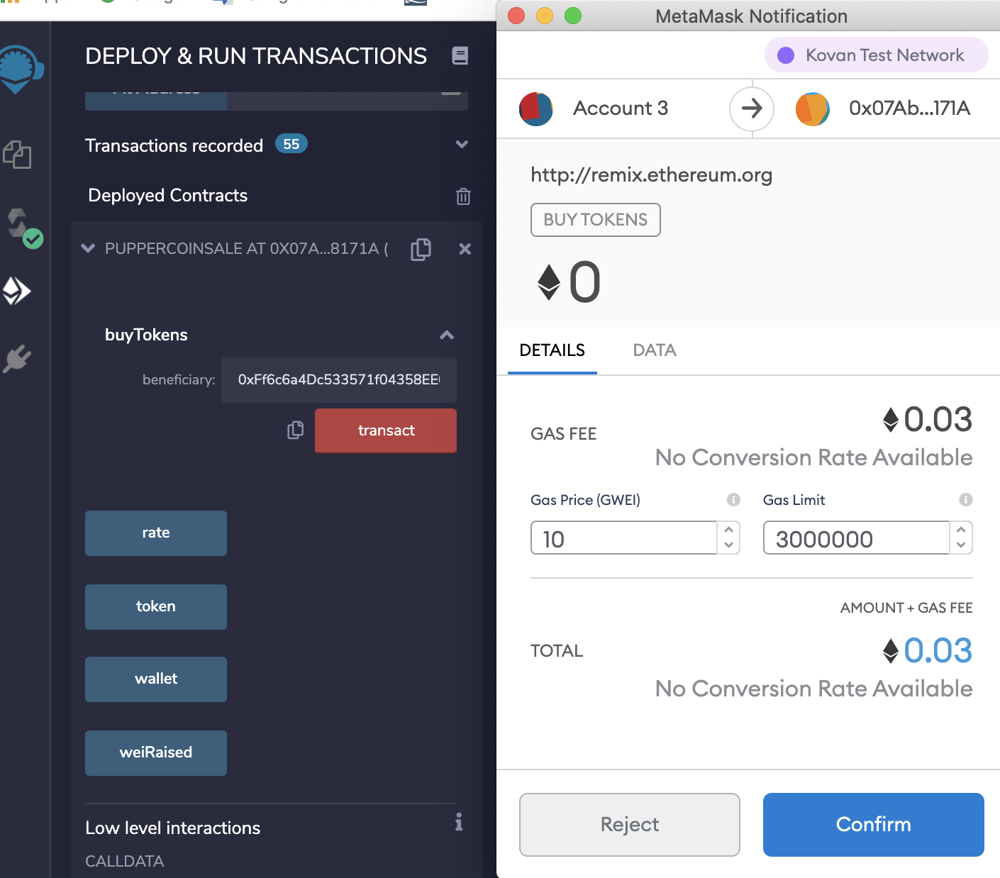
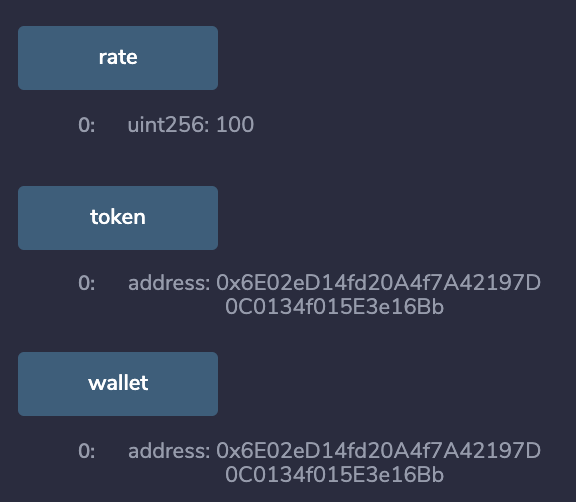

# hw21-advanced-solidity

# Unit 21: You sure can attract a crowd!

## Background

Your company has decided to crowdsale their PupperCoin token in order to help fund the network development.
This network will be used to track the dog breeding activity across the globe in a decentralized way, and allow humans to track the genetic trail of their pets. You have already worked with the necessary legal bodies and have the green light on creating a crowdsale open to the public. However, you are required to enable refunds if the crowdsale is successful and the goal is met, and you are only allowed to raise a maximum of 300 Ether. The crowdsale will run for 24 weeks.

You will need to create an ERC20 token that will be minted through a `Crowdsale` contract that you can leverage from the OpenZeppelin Solidity library.

This crowdsale contract will manage the entire process, allowing users to send ETH and get back PUP (PupperCoin).
This contract will mint the tokens automatically and distribute them to buyers in one transaction.

It will need to inherit `Crowdsale`, `CappedCrowdsale`, `TimedCrowdsale`, `RefundableCrowdsale`, and `MintedCrowdsale`.

You will conduct the crowdsale on the Kovan or Ropsten testnet in order to get a real-world pre-production test in.

## Files

* [`PupperCoin.sol`](Code/PupperCoin.sol) 

* [`Crowdsale.sol`](Code/Crowdsale.sol) 

## ERC20 PupperCoin

You will need to simply use a standard `ERC20Mintable` and `ERC20Detailed` contract, hardcoding `18` as the `decimals` parameter, and leaving the `initial_supply` parameter alone.

## Crowdsale.sol

* Imports

* PupperCoinSale contract

* PupperCoinDeployer contract

#### Test the contract

* In the `Deploy` tab in Remix, 

* Deploy Remix

* Deploy Metamask

* Deploy Etherscan

* Buytokens

* Rate

